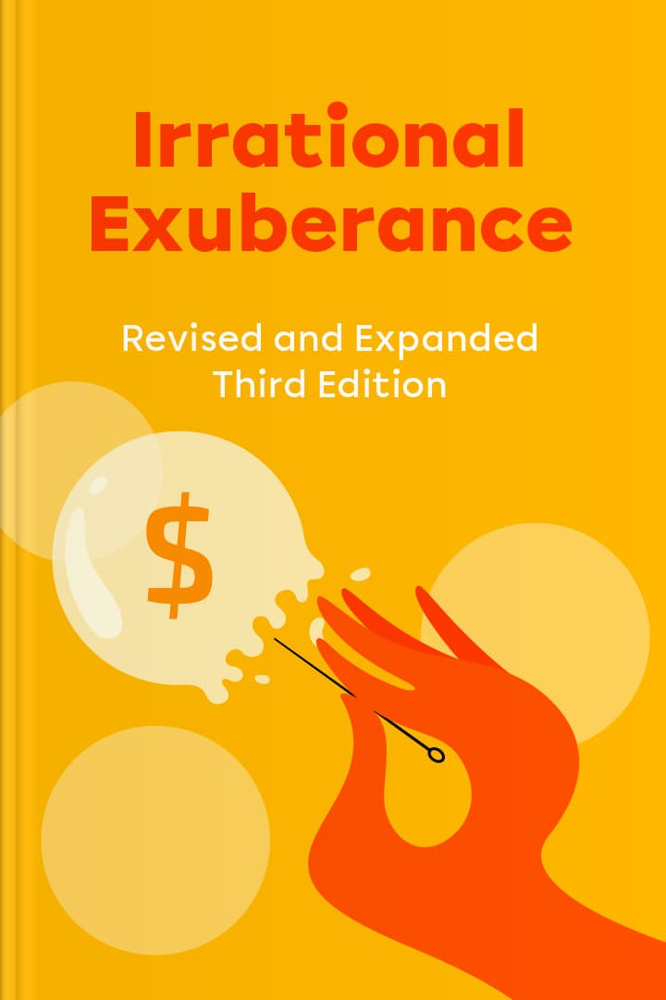

# Irrational Exuberance

> 來源：https://app.makeheadway.com/books/irrational-exuberance
> 擷取時間：2026-04-01 10:16:17

---

## Page 1

### Speculative markets are ever-changing beasts

The first question you might have is about the actual meaning of “irrational exuberance” and how it links to the world’s financial markets. Put simply, it is a term given to describe the optimism within a specific market about the prices experienced at any given time. When they’re high, we’re all riding on the crest of a wave and can never see a time when they’re going to drop. Of course, they do drop, and in some cases, they crash. Robert J. Shiller argues that irrational exuberance comes down to a range of psychological factors, including influence by the media and our desire to listen to self-proclaimed experts.

There have been many market crashes throughout the years, with the most notable and recent in 2007-2008; the entire world felt this financial crisis. It’s easy to assume that we should have learned from that experience and perhaps put new mechanisms into place to avoid it happening again. However, it seems that hasn’t happened. Instead, many people are investing money in markets that are expanding at an alarming rate, precisely in the same way that led to the last market crash.

With high bond and stock valuations, the chances of another financial disaster look to be looming large on the horizon. But this isn’t just the case in the US, as the trend seems to be repeating itself worldwide, with high housing prices in many countries.

The last financial crisis left its scars, and the world didn’t bounce back in the way many predicted.

The International Monetary Fund warned about the price of housing worldwide, and the Bank for International Settlements has given similar warnings.

While the situation isn’t as dire as before the last financial crisis, it’s important to heed these warnings and make changes before another major global issue hits. Markets move at a swift rate, and ever-changing technology and market patterns help to drive volatility.

In this summary, you will learn more about the influences behind market change and what we need to do to help prevent another crash in the future. Acting now could help to avoid significant issues felt across the world.

1 of 7

---

## Page 2

### Market bubbles grow fast and can burst at any time

Economics isn’t an easy subject to understand and is made more complex by the fast-moving pace of worldwide speculative markets. There are many terms and buzzwords to learn, but one very pertinent to financial crashes and booms is “bubble”.

In this case, we’re talking about economic bubbles or market bubbles. There have been many different ways to explain what a bubble is and why it has been volatile throughout the years. Still, the simplest way is to say that a bubble is when prices rise quickly and at pace within any particular market, pushed by a range of situations and opinions at any one time. As momentum grows, so does the bubble. But, as we know, bubbles can only grow so big before they burst.

Robert J. Shiller argues that the term “bubble” may be a little overused and misinterpreted depending upon the expert doing the talking. For instance, Eugene Fama, the famed economist and 2014 Nobel Prize in Economics winner, thinks that a bubble relates to a price increase that is irrational and likely to lead to an extremely steep and fast decline. But Shiller argues that decline isn’t always inevitable if measures are in place to hold prices steady.

When a bubble is happening, the psychological backdrop within society is essential. How the public feels within a market can inflate the bubble or cause it to burst.

During a bubble, many people think they’re riding on the crest of a wave and that prices will continue to bring significant rewards on investments. As such, they get carried away and invest too much, further driving the bubble and leading to its eventual crash.

You cannot predict market bubbles easily, and they often rise and burst in different ways. Some don’t burst, but others do, and rather spectacularly. For instance, Black Tuesday, also referred to as the Wall Street Crash of 1929, didn’t crash just once and then recover.; it recovered and crashed three times in total, showing that bubbles are never predictable and are always volatile.

But Shiller notes that by understanding the driving forces behind the growth of market bubbles, along with early intervention, the outcome doesn’t have to be financially catastrophic.

2 of 7

---

## Page 3

### Many people shrink into denial when a market bubble increases

Robert J. Shiller has always been fascinated by human behaviors and reactions to market growth and occasional crashes.

In 2000, after writing the first edition of Irrational Exuberance, he traveled around the US promoting the book, meeting many financial professionals and ordinary people interested in investments; many held stocks and bonds and actively invested their hard-earned cash.

People don’t want to hear negative news about their investments. Instead, they bury their heads in the sand and focus on the false positives.

The stock market was booming during the book tour, but Shiller had a distinct sense that things would not remain so rosy. He talked about this during the tour, but many people actively disagreed. He noted with curiosity how people reacted when he spoke about the possibility of a market crash. Many actively told him that he was wrong, but most had no experience or knowledge of financial markets; they listened to what they read or what experts said on the news. Yet, despite their denial of any problem, he noticed that they seemed quite worried or agitated beneath the surface.

The most common theme in the 1987 answers to this open-ended question was that the market had been overpriced before the crash. ~ Robert J. Shiller

Robert J.

After giving an in-depth presentation to a group of investors, the institutional portfolio manager approached him, telling him that although he agreed wholeheartedly with what Shiller had said, he would actively ignore it. Upon questioning him why he thought this, the manager told Shiller that a lack of authority was the issue; he knew people would ignore the advice and do what they wanted to do anyway. People were surfing that wave and didn’t want it to stop, so they remained in denial.

But, as per Shiller’s prediction, the stock market went into decline after 2000, and many people found their investments were worth considerably less than before.

Did you know? The US’s Great Crash in 1929 was so severe that it caused the Great Depression throughout the 1930s. The depression lasted a whole decade and affected many countries worldwide.

3 of 7

---

## Page 4

### The driving forces behind market booms and crashes are never simple

To understand what drives a market to gain significant traction exceptionally quickly and then crash, we need to understand the forces behind the situation. These are plentiful and complicated, but it also comes down to a simple matter of misinformation in some cases.

Time and time again, we see market bubbles forming and crashing, but outside influences often force markets to behave in a volatile way. The financial world is a complicated subject, and many things happening at any one time can affect whether a market grows or recedes.

It’s easy to look straight at associated issues, such as interest rates. For sure, favorable interest rates can help to explain many different fluctuations within a speculative market, especially when it comes to housing. Still, they can only account for so much. Focusing upon one element only gives you a portion of the story, and it’s better to look at patterns and trends that occur over a long period.

Shiller also points to the rapid advances in technology, a focus on business success, capitalism, increased enjoyment of gambling, and elevated risk-taking. He also highlights the Baby Boom that occurred after World War II as likely to be a driver behind some of history’s biggest crashes.

Many families had postponed having children until the war ended. So, by 2000, when another market crash occurred, many of these children were between 35-55, an age group that was far more likely to seriously explore investments to line a nest egg for their retirement, driving the stock market and pushing prices higher.

Speculative markets are affected by outside influences, perhaps far more than those inside.

We can’t ignore the idea of morale either. When people feel upbeat about the financial forecast, they’re more likely to invest. We’re living in a time when materialism is becoming a primary focus. Many view investments as the catalyst to earning fast money so they can purchase their dream items.

Such feelings transformed our culture into one that reveres the successful businessperson as much or even more than the accomplished scientist, artist, or revolutionary. ~ Robert J. Shiller

Robert J.

4 of 7

---

## Page 5

### The media has a role to play in speculative markets

Out of all the elements which may affect how a speculative market behaves, we cannot ignore the role of the media. The media, be it the Internet, TV news, or newspapers, is vast and powerful and has a significant influence on the way people think, feel, and act. Newsworthy stories are screamed at high volume over headlines and constantly repeated, causing people to believe what they read without stopping to question that it may simply be nothing more than sensationalism.

It’s no surprise to learn that speculative bubbles gained traction when newspapers appeared in the mainstream, and it’s not a coincidence. The media portrays itself as a wholly detached body, simply a vessel for communicating news to the masses. However, it drives morale and feelings within a market by presenting its words in a certain way.

When a significant event occurs within a market, it tends to be that there is a very similar way of thinking between a large group of people.

The fact the media can drive a specific message quickly, be it right, wrong, or misinterpreted, pushes a narrative that people feel they should believe. The stock market is excellent fodder for newspapers because it changes daily, allowing daily headlines.

The housing market is also a popular area that the media have infiltrated. Hugely successful TV shows based around property purchasing and renovation, such as HGTV in the US and Property Ladder in the UK, give the media a chance to inform us what we should or shouldn’t think about another speculative market that can be highly volatile — real estate.

Shiller gives the example of Ravi Batra, author of The Great Depression of 1990: Why It’s Got to Happen and How to Protect Yourself, who appeared on a popular American news program just days before the 1987 stock market crash. Batra’s book explained his theory that the depression would happen again and that everyone must act now to save themselves. Batra’s theory wasn’t based on firm evidence by any means, but his appearance on a respected news show may have contributed toward the crash. Such is the power of the media.

5 of 7

---

## Page 6

### Early interventions may help to prevent market crashes in the future

Much of the time, social elements affecting speculative market behavior are hard to predict. Advice often comes from people who don’t have the best intentions or experts who don’t fully explain their advice to the public. Social psychology plays a massive part in speculative market crashes, and it cannot be denied. Refusing to listen to advice is likely to be the case when someone is getting a great return on investment, and they don’t want to stop to think that perhaps their investment could work the opposite way for them.

The stock and housing markets, in particular, are pretty confusing; it’s easy to take risks without being fully informed. People need to be far clearer on what bubbles are and what to do if they see one forming. You may not be able to do anything to stop a crash, but you can take action to minimize your losses. Feeling powerless to prevent a loss from happening is common, but there are some things you can do.

Those in the public domain should avoid giving forecasts and valuations and leave it to those seriously in the know.

Administrations should ensure that financial policies don’t push bubbles too far and instead “lean gently” on them. The government’s strict monetary policy to minimize damage actually worsened the 1929 stock market crash, and attempts made to stabilize the markets via interest rate changes fueled the chaos of The Great Depression. Rather than quick fixes, leaders should instead focus on stabilizing a market through policy change.

They can also speak out and build confidence within the public and avoid panic selling and actions that could further worsen the crash. John D. Rockefeller famously spoke out during the US stock market crash in 1907, affirming his faith in recovery. Short circuit breakers to help close down a market when trading is particularly volatile may also help.

Of course, the general public needs more advice on investing and avoiding risk. Diversifying investments is crucial in reducing potential loss, but many people are unsure what this means and how to do it. Rather than so-called experts giving questionable advice, analysts and investment advice personnel should provide actionable guidance to cut out the confusion.

6 of 7

---

## Page 7

### Conclusion

Investments are an excellent way to earn money over the long term. Not everyone finds it easy to save money by putting cash away every month into a savings account; the temptation to ‘dip’ into their savings throughout the month is often too great. So, investments offer a solution that removes the temptation and increases the potential for return over time. But not understanding what you’re investing in and how the market can change may lead toward financial loss instead of gain.

Speculative markets have long been known for their risks, but you minimize them by investing carefully. Market crashes are nothing new. Bubbles have been forming and popping for centuries, but it seems that we haven’t learned the lesson; the same old problems keep arising with the same old outcome. Rather than repeating mistakes, maybe it’s time to make substantial changes and try to stabilize the markets that have long been known for their volatility.

There’s no denying that a psychological element is at play. When something is going well, you don’t want to think it might end, and the same goes for investments. When your investment is earning a vast amount of cash because the market is booming, you’re happy, and you’re keen for the same thing to keep happening. You bury your head in the sand when someone tells you that it’s all about to go very wrong, because why would you want to believe something so negative. Of course, having less than informed knowledge on investments doesn’t help either.

By learning more about speculative markets, you can keep your mind focused on the likelihood of success. It’s also vital for financial institutions and governments to put early stabilizing inventions into place to avoid crashes. By doing all of this, perhaps we can prevent future market crashes completely.

Try this

• Before you choose to invest in a speculative market, seek out solid, professional advice.
• Don’t be tempted to invest in just one thing.
• Keep a clear and stable head. After all, what goes up, must come down, which applies to speculative market investments!

7 of 7

Read it till the end?

---

## About the Author

Discover

Library

Infographics

Explore Headway for Teams

Profile

Irrational Exuberance

Robert J. Shiller

7 key points
13 mins
6 insights
Read
Listen
What's inside
Unpack the psychology behind market bubbles and crashes. Navigate investments wisely.
You’ll learn
Why markets overheat
How media sways investment
Secrets to spotting bubbles
Smart diversification tips
Key points

1

Speculative markets are ever-changing beasts

2

Market bubbles grow fast and can burst at any time

3

Many people shrink into denial when a market bubble increases

4

The driving forces behind market booms and crashes are never simple

5

The media has a role to play in speculative markets

6

Early interventions may help to prevent market crashes in the future

7

Conclusion

About the author

Nobel Laureate Robert J. Shiller is a trailblazer in economic thought, known for his work on market volatility, whose insights have shaped financial understanding globally.

This content is for educational purposes only and not intended as medical advice. Please note that this summary may contain opinions that don’t reflect our own. Also, it may not be endorsed by the author or affiliated with the publisher. For more information, click here

📥 開始抓取此書內容
