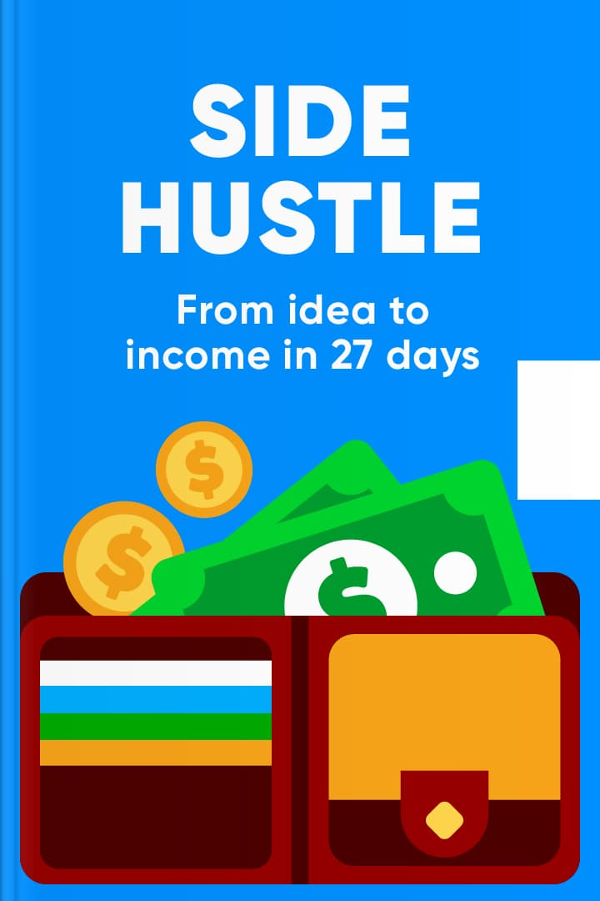

# Side Hustle

> 來源：https://app.makeheadway.com/books/side-hustle
> 擷取時間：2026-04-01 10:17:40

---

## Page 1

### Turn a simple idea into a money–making machine

Let’s face it; everyone wants more money. If you wish to admit it or not, the idea of having more cash in your bank account is highly appealing. The problem is, most people don’t like the idea of leaving the security of their regular job to go in search of a new business idea that may or may not work. The security of a monthly paycheck is far too important to risk.

A side hustle is an idea that you develop into a money–making scheme. The plus point is that you don’t have to put forth much effort for this idea to continue sending cash your way, and you also don’t need a massive amount of money to get the idea off the ground.

Chris Guillebeau gives us a great example of a man from Britain who wrote a few Amazon reviews on fish tanks but then thought no more of it and forgot about it. A few months later, he received a check in the post for $350! He continued writing reviews from that point on and began earning around $700 for his small efforts.

A side hustle is a way to make cash without having to give up the security of your regular job. It gives you options, confidence, and it gives you financial freedom. “Side Hustle” teaches you how to take a small idea and develop into something with real potential.

You have no idea how far a small idea can go. Your side hustle may turn out to be a real money–maker!

1 of 8

---

## Page 2

### Money can grow on trees if you plant the seeds correctly

We’ve all heard the saying “money doesn’t grow on trees,” well, guess what? It actually can! All you need to do is plant the correct seeds in the right place, nurturing the soil to ensure health and vitality. Your side hustle, if done correctly, will allow you to collect money from metaphorical trees.

A side hustle will allow you to feather your financial nest with minimal effort over time.

Chris Guillebeau believes that everyone should have some side hustle, regardless of how they feel about their job. A side hustle allows you to continue paying your bills and enjoying your lifestyle. Still, you’re also developing something on the side which could fund your future, will enable you to do something unique, perhaps travel, or give you more freedom and choice with how you spend your cash. Your hustle could also develop itself into a serious business at some point in the future.

Before you begin, however, you need to ask yourself these two questions:
• Does the idea of having more than one income appeal to you?
• Can you afford to give half an hour every day for the next 27 days to build your idea into a successful side hustle?

If you’re nodding your head to both questions, side hustling is for you.

The biggest misconception about making money from a business start–up, big or small, is that you need a large amount of capital to begin, experience running a business, and need a significant amount of time to dedicate to it.

All of those ideas are incorrect.

Side hustling doesn’t require a lot of time, it doesn’t require a significant cash injection initially, and you don’t need any special knowledge or a degree to begin. All you need is an idea. You also don’t need a team of people behind you, although asking for advice and support is never a bad thing.

Effort and a willingness to learn is more important than capital when it comes to establishing a side hustle.

2 of 8

---

## Page 3

### To start a side hustle, you need to first identify your idea

To begin earning cash from your side hustling endeavors, you first need to develop a range of ideas and then work out which is the most profitable. Week one is about coming up with ideas that create profits.

Every idea you come up with could create profits in theory, but some are more likely than others.

Your idea should be realistic, it should make money, and it should be something that people want to buy/receive.

Your idea also needs to be something that gives you a sense of excitement when you think about it, something which you can quickly imagine getting off the ground and visualizing the first steps towards success. If your idea will take a long period to get started, it’s not the right idea for you. It needs to be quick and effective.

You will have two types of ideas at this point ― starter ideas and then NLIs (next–level ideas). Starter ideas are the first flourishes that pop into your mind, and you create an NLI from brainstorming that idea and taking it to the next level. An example of a starter idea might be that you want to sell the clothes cluttering up your wardrobe. The next level idea would be buying old clothes from other people and then selling them on for a higher price, thus making a profit.

Once you’ve come up with 3 main ideas which you can turn into NLIs, brainstorm their pros and cons. This is the opportunities they will bring you (pros) and the constraints that may stand in your way (cons). All ideas will have both, which is part of the ‘whittling down’ process to arrive at your final decision.

The final point in week one is to work out potential profitability. While you need to enjoy your side hustle, money is the main aim. You, therefore, need to go for the most profitable option.

Did you know? During the COVID–19 pandemic, the Internet became the place to earn money. From online tutoring to selling second–hand goods, the possibilities for making cash online are endless.

3 of 8

---

## Page 4

### How to adopt Tinder–thinking to your ideas so you can make the right choice

From your work in week one, you now have a shortlist of three ideas. Week two is about streamlining the list further and arriving at your final idea.

Chris Guillebeau suggests using a Tinder way of thinking, i.e., basing your choice on how it looks and what it can bring to you. How quickly can your idea be executed (efficiency), and how motivated are you to work with it? Remember, it has to be fun!

Draw a table for each idea. You can then compare your three shortlisted ideas to find out which has the highest potential for success. You have now identified your final idea!

Go for the idea which will bring you profits, but it also has to be something you’ll enjoy doing.

Once you know which idea you’re going to take forward, it’s time to do some research and look at who else might be doing something similar. You can then work out how to do it differently or do the same thing but far better than they’re doing. If you want to sell products or services, it’s no good copying a model already out there; you need to do something slightly different or far better.

The next step in week two is to turn your idea into a final offer. Your offer is what you are going to offer to people in return for their cash. Your offer needs include:
• A promise: what will they get in return?
• A pitch: sell it to them, make them believe they need it
• A price: a realistic and fair price for your goods/services
• Call to action: create the excitement and then give people a way to buy or find out more information

A successful offer doesn’t just show people why they need what you are selling; it also shows them why they need it now. ~ Chris Guillebeau

Chris Guillebeau

Try your best to include a back story within your offer, something that provides a personal connection between the product/service and the person you want to purchase. Doing this will give you a far greater chance of making a sale. You can make your offer via a website, a flyer, a social media post, but however you do it when you receive inquiries, you must reply as quickly as possible.

Reply to queries quickly; keeping people waiting means less chance of a sale/order.

4 of 8

---

## Page 5

### Assemble the tiny details of your plan for success so you don’t leave out an important step

You have your idea, you have your offer, and you’re almost ready to launch, but you need to work out the details before you do. This is your final checklist to ensure that everything is in place; your workflow has been identified, and when your first sale comes in, you know what to do.

This week you need to:
• Open a bank account to be used for your side hustle only
• Have a separate credit or debit card for side hustle expenses
• If you need to purchase any supplies, pay for them upfront and don’t get yourself into debt from the get–go
• Save 25% of your profits for taxes
• Develop an invoicing system (if necessary), and work out how to do this quickly
• Work out a straightforward method for accounting and keeping track of your cash flow
• Set up space which you use for your side hustle admin tasks

Make sure you cover all the basics before you launch. The smallest detail can unravel your plan!

Before you launch, work out how to price your offer to your customers, ensuring that you don’t stray too far from market prices but that you also make it worth your while ― that’s the whole point, after all! If you’re receiving payments from customers online, you’ll need to set up PayPal, Shopify, or Stripe.

The final week three task is to arrange your workflow. This is a list of actions when an order is placed, processed, despatched, and for payment to be received. Write down your list and double–check to make sure you haven’t forgotten anything. Be as detailed as you can, so you can easily follow the process from start to finish.

Create a detailed workflow to avoid confusion and ensure a smooth transaction for your customers.

5 of 8

---

## Page 6

### When you’re ready, launch your plan!

There is a difference between blindly launching your plan and doing it in the right way — launching it to the right people. This is your aim during week four. It’s always better to launch your offer a little before you’re ready. This might sound counterproductive, but if you begin to receive interest and orders before you’re ready to start, you’re also receiving validation, also referred to as “proof of concept.” This will give you more confidence.

The more validation you receive, the more confident you will be in your idea.

It’s essential to sell by inviting people to buy. This isn’t about pushing an idea down someone’s throat; there is no guilt involved; it’s simply about making someone feel good and highlighting what the product or service can do for them. This is how you need to sell your plan.

No man is an island, and few side hustles thrive without the help of friends and supporters. ~ Chris Guillebeau

Chris Guillebeau

You should enlist the help of at least 10 people. These include supporters, influencers, mentors, and ideal customers. You cannot do everything alone, and the support of these people will also allow you to see where things may need to be tweaked and improved. You can also use the help of these people to conduct an A/B test.

The A/B test is a way of finding out which route or idea a potential customer would prefer. A simple idea would be to give a supporter of yours two different options of the service you provide and ask them which they like best. You need to conduct A/B tests on the things which matter and not random pieces of information which aren’t going to make a big difference to how much cash you make.

The final part of week 4? When you make your first dollar, make sure you frame it and pat yourself on the back!

6 of 8

---

## Page 7

### As your side hustle grows, ensure you measure and adjust to optimize profits

Now your hustle is up and running and making cash; it’s essential to measure how well you’re doing and identify whether any changes need to be made. This will help you to track your progress and optimize the amount of cash you’re making.

Ask yourself whether your plan is working. There will be three potential answers: it’s working well, it’s not working at all, doing okay but could be better.

Most ideas will come up with the third outcome, and this is the best. The reason it’s better to be doing okay rather than well is because you can make changes and optimize how much money you’re making in this situation. You can find out helpful information and push your hustle further.

If, however, you’re finding that your hustle simply isn’t working out and it’s not making cash, it’s time to cut your losses and move on. It’s hard to admit defeat, but at least you tried.

The main metrics you need to track are:
• Profits: how much money you make minus the cost of expenses
• Growth: the number of new customers or clients you have received
• Time: how many hours you’re spending on your hustle every week

If your hustle is doing okay but could be better, look at those three metrics, revise your plan and then go again, using the new information to tweak how you do things. Do more of the things that are working, and cut out the things which aren’t working.

It’s a good idea to do a further audit on your hustle every few months. As your hustle develops, your workflow will change and grow, so make sure you review your processes regularly and write everything down. This gets everything out of your head and makes your hustle far less stressful as a result.

Be sure to change your workflow as your hustle increases in success. Make sure everything is as easy as possible.

7 of 8

---

## Page 8

### Conclusion

A side hustle is an ideal way to make more cash from minimal effort, but it’s also a great way to boost your confidence and give yourself a hobby that has a profitable outcome. As long as you choose something you enjoy doing, something that makes you feel proud of your efforts, and something that brings in cash, you’re onto a winner!

By following the steps outlined within “The Side Hustle,” you will be able to develop a simple idea into a money – making machine with very little time spent on it. What does the future hold from there? Who knows! You could quickly develop your side hustle into a significant business endeavor, or you could cut your losses and start over again, using what you have learned to create another enjoyable idea into a profitable experience.

Some of the most popular YouTubers in the world started with very humble beginnings. Take inspiration from such people and keep focusing on the future rather than where you are right now. As long as you continue to monitor your success and look for ways to improve consistently, there is no limit to what you could achieve.

However, it’s equally as important to be humble; not every idea will work. In that case, go back to basics and develop another concept that has better profitability potential and a greater level of enjoyment for you. Once your side hustle is established and basically runs itself, you’ll be able to look back and see just how far you’ve come. It’s not all about endless capital, sometimes a little enthusiasm and creativity can get you just as far.

Try this
• Write down a list of the things you enjoy doing in your spare time.
• Identify how you might be able to make cash from each of those activities.
• Develop an NLI (next–level idea) from each activity.

8 of 8

Read it till the end?

---

## About the Author

Discover

Library

Infographics

Explore Headway for Teams

Profile

Side Hustle

Chris Guillebeau

8 key points
14 mins
10 insights
Read
Listen
What's inside
Uncover innovative strategies to launch a successful side business while keeping your day job. Boost your income and financial independence with the principles of entrepreneurship and self-reliance.
You’ll learn
How to pick winning ideas with 'Tinder-thinking'
The art of crafting an offer that sells
Why resilience trumps capital in hustling
Strategies for tracking success and tweaking plans
Key points

1

Turn a simple idea into a money–making machine

2

Money can grow on trees if you plant the seeds correctly

3

To start a side hustle, you need to first identify your idea

4

How to adopt Tinder–thinking to your ideas so you can make the right choice

5

Assemble the tiny details of your plan for success so you don’t leave out an important step

6

When you’re ready, launch your plan!

7

As your side hustle grows, ensure you measure and adjust to optimize profits

8

Conclusion

About the author

Chris Guillebeau is a New York Times bestselling author and entrepreneur, known for his work in the self-help and business genres.

This content is for educational purposes only and not intended as medical advice. Please note that this summary may contain opinions that don’t reflect our own. Also, it may not be endorsed by the author or affiliated with the publisher. For more information, click here

📥 開始抓取此書內容
